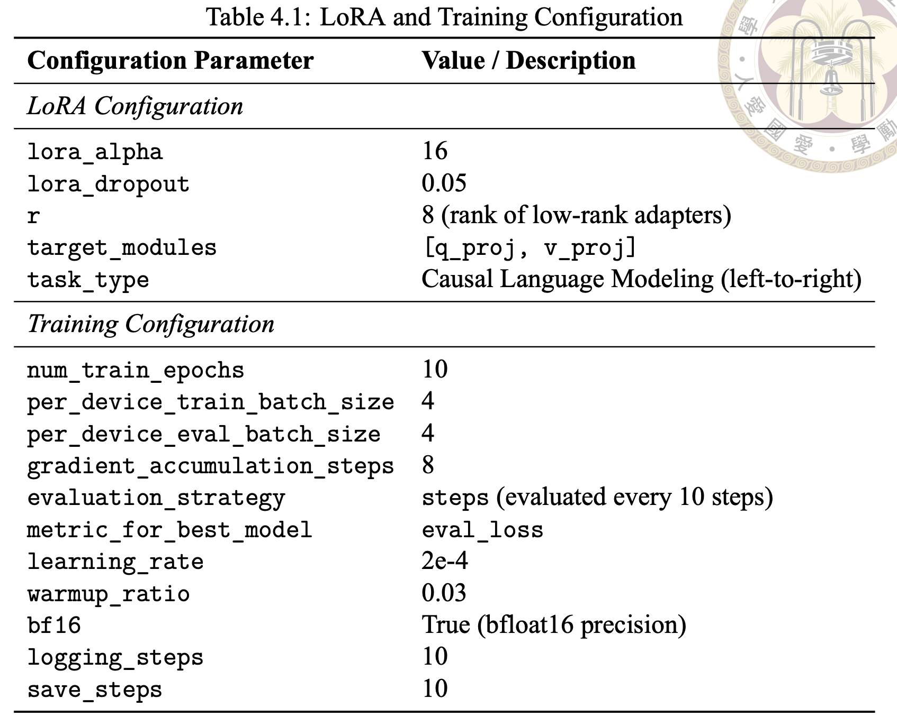

# Reprodce-YM-s-Thesis
## Trajectory Planning in Dense Urban Environments: Utilizing Vision-Language Models to Learn Socially-Aware Behaviors for High-Uncertainty Scenarios
This repository documents the reproduction of my senior’s work on trajectory-aware fine-tuning of **LLaVA-1.5-7B** for dense urban autonomous driving scenarios (TITAN dataset).

The goal of this reproduction is:

- ✅ Reconstruct spatial supervision via COLMAP
- ✅ Fine-tune LLaVA with KL-regularized LoRA
- ✅ Reproduce reasoning + waypoint prediction performance
- ✅ Establish a stable baseline for future vision token pruning research

---

# 1. Environment Setup

## 1.1 Conda Environment

```bash
conda create -n llava_kl_lora python=3.10 -y
conda activate llava_kl_lora
pip install -U pip setuptools wheel
````

---

## 1.2 PyTorch Installation

### ⚠ For RTX 5090 (CUDA 12.8 nightly)

```bash
pip uninstall -y torch torchvision torchaudio
pip install --pre torch --index-url https://download.pytorch.org/whl/nightly/cu128
```

### Otherwise (A6000 / 3090 etc.)

Install the stable CUDA version matching your driver.

---

## 1.3 Required Python Packages

```bash
pip install \
  "transformers==4.41.2" \
  "accelerate==0.31.0" \
  "peft==0.11.1" \
  "tokenizers==0.19.1" \
  "huggingface_hub>=0.23,<1.0" \
  "protobuf" \
  "sentencepiece" \
  "datasets==2.20.0" \
  "pillow" \
  "opencv-python" \
  "tqdm" \
  "numpy" \
  "scipy"
```

---

# 2. Project Folder Structure

```
ym_reproduce/
│
├── train_llava_lora.py
├── infer_llava_lora.py
├── evaluation.py
│
├── dataset/
│   └── images_anonymized/
│       └── clip_x/
│           └── images/
│
├── fill_json/
│   ├── titan_train_filled.json
│   └── titan_train_no_cue.json
│
├── ckpt_kl_lambda0p01_bf16/
│
└── results/
```

---

# 3. Fine-tuning Details

## 3.1 Model Backbone

* Base Model: `llava-hf/llava-1.5-7b-hf`
* Fine-tuning method: LoRA
* Loss:

  * Cross-entropy (reasoning + waypoint tokens)
  * KL regularization to control hallucination
* Output format:

  * Reasoning (CoT)
  * Ｗaypoint pairs (x, y)

---

## 3.2 Training Command

```bash
python train_llava_lora.py \
  --model_name llava-hf/llava-1.5-7b-hf \
  --train_cue ./fill_json/titan_train_filled.json \
  --train_nocue ./fill_json/titan_train_no_cue.json \
  --image_root dataset/images_anonymized \
  --output_dir ./ckpt_kl_lambda0p01_bf16 \
  --max_length 4096 \
  --per_device_train_batch_size 2 \
  --gradient_accumulation_steps 16 \
  --num_train_epochs 1 \
  --learning_rate 2e-4 \
  --warmup_ratio 0.03 \
  --lambda_kl 0.01 \
  --temperature 1.0 \
  --bf16 \
  --gradient_checkpointing
```

---

## 3.3 Key Hyperparameters

<table>
<tr>
<td width="55%">

| Parameter | Value | Description |
|------------|--------|-------------|
| batch size | 2 | per GPU |
| grad accumulation | 16 | effective batch = 32 |
| max length | 4096 | supports long CoT |
| learning rate | 2e-4 | LoRA training |
| lambda_kl | 0.01 | controls hallucination |
| bf16 | enabled | A6000 / 5090 compatible |

</td>

<td width="45%" align="center">



<br>

LoRA and Training Configuration

</td>
</tr>
</table>

---

# 4. Evaluation

Evaluation includes:

* Text metrics (reasoning quality)
* Waypoint L2 error

---

Example Result

```json
{
  "bleu4": 0.3312288595914515,
  "rougeL_f1": 0.39126456154892464,
  "meteor": 0.5368330601352392,
  "l2_distance_error": ...
}
```


---

## 4.1 Running Batch Evaluation

All evaluation scripts should be executed inside:

```bash
cd ./evaluation_script
````

---

### 4.1.1 Without LoRA (2-shot ICL)

This runs inference using the base model with in-context learning (2 examples).

```bash
python batch_infer_eval.py \
  --no_lora \
  --base_model llava-hf/llava-1.5-7b-hf \
  --image_root ../dataset/images_anonymized \
  --cue_json ../fill_json/titan_test_filled.json \
  --nocue_json ../fill_json/titan_test_no_cue.json \
  --num_samples 1 \
  --seed 42 \
  --text_only_icl \
  --out_pred_json ./pred_batch_icl.json \
  --out_eval_json ./eval_batch_icl.json \
  --reasoning_only_text_metrics \
  --l2_mode max
```

**Description:**

* `--no_lora` → disables LoRA weights
* `--text_only_icl` → uses reasoning examples only
* `--reasoning_only_text_metrics` → evaluate text metrics on reasoning part only
* `--l2_mode max` → L2 max error computed (other option: mean)

---

### 4.1.2 With LoRA Weight

This runs inference using the fine-tuned LoRA checkpoint.

⚠ Make sure your LoRA checkpoint directory is correctly specified inside `batch_infer_eval.py`.

```bash
python batch_infer_eval.py   \
  --use_lora \
  --base_model llava-hf/llava-1.5-7b-hf \
  --adapter_path ../ckpt_lambda0pp1_with_eval \
  --image_root ../dataset/images_anonymized \
  --cue_json ../fill_json/titan_test_filled.json \
  --nocue_json ../fill_json/titan_test_no_cue.json \
  --num_samples 51 \
  --seed 42 \
  --out_pred_json ./pred_batch_eval.json \
  --out_eval_json ./eval_batch_eval.json \
  --reasoning_only_text_metrics \
  --l2_mode max 
```

**Additional Notes:**

* `--bf16` recommended for A6000 / 5090
* Do NOT use `--no_lora` if loading LoRA weights
* Ensure correct checkpoint path inside script
* Results will be saved as:

  * `pred_batch_lora.json`
  * `eval_batch_lora.json`

---

### 4.4.3 Output Files

| File                 | Description                     |
| -------------------- | ------------------------------- |
| pred_batch_icl.json  | Predictions without LoRA        |
| eval_batch_icl.json  | Evaluation metrics without LoRA |
| pred_batch_lora.json | Predictions with LoRA           |
| eval_batch_lora.json | Evaluation metrics with LoRA    |

---

This setup allows direct comparison between:

* Base model + ICL
* Fine-tuned LoRA model

to verify reproduction fidelity and trajectory accuracy.


---

## 4.2 Qualitative Visualization 
Visualization results are from TITAN test set.
### Clip 188
#### Reasoning:
- W/O Fine-tune:
> The ego vehicle should stop and wait.
> - **Pedestrians Crossing**: Objects 6 and 8 are walking on the road. Their safety is a priority, and the vehicle should yield to them.
> - **Parked Vehicles**: Objects 2, 5, and 7 are parked and do not obstruct the vehicle's path, but they contribute to a potentially narrow passage, emphasizing the need for careful navigation once it's safe to proceed.
> - The vehicle should remain stationary until the pedestrians have safely crossed and then proceed slowly, ensuring the path is clear.
- W/ Fine-tune:
> The ego vehicle should proceed with caution. Here's the reasoning:
> - **Pedestrians**: There are two pedestrians (Objects 6 and 8) walking on the road. The vehicle should move forward slowly to signal its intent to proceed while ensuring it does not startle or endanger them.
> - **Parked Vehicles**: There are parked vehicles (Objects 0, 2, 5) on the sides, but they do not obstruct the path significantly.
> - **Stopped Vehicle**: Object 4 is a stopped vehicle. The ego vehicle should ensure there is enough lateral clearance before passing it.
> - **Person Cleaning**: Object 7 is a person cleaning an object. The vehicle should maintain a safe distance and be prepared to stop if necessary.
> - **Action**: The ego vehicle should move forward slowly, maintaining a safe distance from pedestrians and being ready to stop if any pedestrian moves unpredictably. This approach ensures safety while making progress.
- Ground truth:
> In this scenario, the ego vehicle should proceed with caution. Here's the reasoning:
> - **Parked and Stopped Vehicles**:
>   - There are parked vehicles on both sides of the road, and a stopped vehicle (Object 4) directly ahead. The ego vehicle should plan to overtake the stopped vehicle if there is enough lateral clearance and it is safe to do so.
> - **Pedestrians**:
>   - There are pedestrians (Objects 6, 7, and 8) on the road. Object 6 and Object 8 are walking, while Object 7 is cleaning and carrying something. The presence of pedestrians requires the ego vehicle to move slowly and be prepared to stop if necessary.
> - **Action Plan**:
>   - **Slow Creep Forward**: The ego vehicle should slowly creep forward to signal its intent to proceed, ensuring it does not startle the pedestrians.
>   - **Monitor Pedestrians**: Keep a close watch on the movements of the pedestrians, especially those walking on the road, to ensure their safety.
>   - **Overtake if Safe**: If there is enough space and no immediate pedestrian risk, carefully overtake the stopped vehicle (Object 4).
> - By proceeding cautiously and being aware of pedestrian movements, the ego vehicle can safely navigate through this urban environment.
#### Waypoints:
<table>
<tr>
<td align="center"><br>W/O Fine-tune</td>
<td align="center"><br>W/ Fine-tune</td>
</tr>
</table>

### Clip 192
#### Reasoning:
- W/O Fine-tune: 
> The ego vehicle should stop and wait.
> - Justification:
>   - **Pedestrians on the Road**: Objects 1 and 5 are walking on the road, and the vehicle should yield to them.
>   - **Pedestrian on the Side**: Object 2 is standing on the side of the road, and the vehicle should be cautious while passing.
>   - **Parked Vehicles**: Objects 3 and 6 are parked, and the vehicle should proceed with caution, ensuring the path is clear.
> - The vehicle should remain stationary until the pedestrians have safely crossed and then proceed slowly, ensuring the path is clear.
- W/ Fine-tune: 
> The ego vehicle should proceed with caution. Here's the reasoning:
> - **Object 1 (Person Walking on the Road):** This person is walking on the road and carrying something. The vehicle should be cautious and ensure there is enough space to pass safely without startling or endangering the pedestrian.
> - **Object 2 (Person Standing and Looking at Phone):** This person is standing and not directly in the path of the vehicle. The vehicle can continue moving slowly, maintaining a safe distance.
> - **Object 4 (Person Walking and Talking in a Group):** This person is walking and talking in a group. The vehicle should be prepared to stop if necessary to ensure the safety of the group.
> - **Object 5 (Person Standing and Looking at Phone):** This person is also standing and looking at their phone. The vehicle can continue moving slowly, as long as it is safe to do so.
> - **Object 6 (Person Standing and Talking in a Group):** This person is part of a group and is also talking. The vehicle should be cautious and ready to stop if the group moves unpredictably.
> - **Object 3 (Parked Vehicle):** This is not obstructing the path and can be ignored.
> - The vehicle should move forward slowly, maintaining a safe distance from pedestrians and being prepared to stop if any of them move unpredictably. This approach ensures safety while making progress.
- Ground truth: 
> The ego vehicle should proceed with caution. Here's the reasoning:
> - **Object 1 (Person walking on the road)**: This person is carrying something with both hands, indicating they might not be fully aware of their surroundings. The vehicle should slow down and be prepared to stop if necessary.
> - **Object 2 and Object 5 (People standing and looking into phones)**: These individuals are stationary and focused on their phones. They are not currently obstructing the path, but the vehicle should be cautious in case they move unexpectedly.
> - **Object 3 (Parked two-wheeled vehicle)**: This is stationary and does not obstruct the path. The vehicle can safely pass by it.
> - **Object 4 and Object 6 (People talking in a group)**: These individuals are on the side and not directly in the path. The vehicle should proceed slowly to ensure they remain out of the vehicle's path.
> - Given these observations, the ego vehicle should move forward slowly, signaling its intent to proceed while being ready to stop if any pedestrian moves unexpectedly into its path.
#### Waypoints:
<table>
<tr>
<td align="center"><br>W/O Fine-tune</td>
<td align="center"><br>W/ Fine-tune</td>
</tr>
</table>

---

## 4.3 Comparison with Senior’s Reported Results
*w/o Fine-tune*
| Metric   | Senior | Reproduced |
| -------- | ------ | ---------- |
| BLEU-4   | 0.036  | 0.083      |       
| ROUGE-L  | 0.19   | 0.146      |       
| METEOR   | 0.37   | 0.197      |       
| L2 Error | 55     | 175        |

*w/ Fine-tune*
| Metric   | Senior | Reproduced(w/o mask) | Reproduced(w/ mask)|
| -------- | ------ | ---------------------| -------------------|
| BLEU-4   | 0.18   | 0.3312               | 0.2576             |
| ROUGE-L  | 0.38   | 0.3912               | 0.3363             |
| METEOR   | 0.52   | 0.5368               | 0.4683             |
| L2 Error | 31     | 51                   | 53                 |

---

# Appendix

# A. Reconstructing Missing Trajectories with COLMAP

Some clips do not contain ground truth camera trajectories.
We reconstruct spatial supervision using:

* Structure-from-Motion (SfM)
* Camera intrinsics & extrinsics
* Keyframe projection of future lookahead points

---

## A.1 COLMAP Pipeline

1. Extract images per clip
2. Feature extraction
3. Feature matching
4. Sparse reconstruction
5. Export:

   * `cameras.txt`
   * `images.txt`

---

## A.2 Projection Method

For each keyframe:

1. Convert quaternion → rotation matrix
2. Compute camera center:

```
C = -R^T t
```

3. Generate lookahead world points
4. Project 3D → 2D onto keyframe
5. Normalize to image resolution

---

## A.3 Design Decision

* Follow senior’s projection-based approach
* No IMU correction used
* All spatial supervision derived from SfM

This ensures:

* Interpretability
* Resolution-aware L2 comparison
* Consistent evaluation pipeline

---

# Reproduction Philosophy

This reproduction strictly follows the original methodology to:

* Match output format (reasoning + 20 waypoints)
* Reproduce trajectory accuracy
* Establish a stable baseline for future pruning experiments

This serves as the foundation for subsequent lightweighting and vision token pruning research.

```
```
